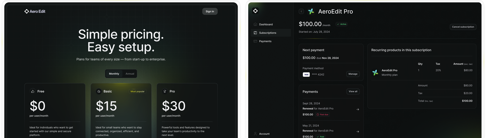

# VitalAI - Health and Fitness Platform

VitalAI is an AI-powered health and fitness platform that helps users track their workouts, monitor nutrition, and get personalized recipe suggestions including authentic Indian cuisine using Google's Gemini API.



## Features

### Personalized Workout Recommendations

- AI-generated workout plans based on user preferences
- Customizable based on fitness level, available equipment, and goals
- Progress tracking with adaptive recommendations

### Comprehensive Health Monitoring

- Macro and calorie tracking
- Water intake monitoring
- Fasting schedule management
- Integration with Google Fit for steps and activity tracking
- Heart health assessment and monitoring

### AI-Powered Recipe Suggestions

- Personalized recipe recommendations with nutritional information
- **Indian Cuisine Specialization** powered by Google's Gemini API
- Filtering by diet type, meal type, and spice level
- Detailed ingredients and step-by-step instructions
- Nutritional breakdown for each recipe

### User Authentication & Personalization

- Secure login and registration
- Personalized dashboard with health metrics
- Custom goals and progress tracking

## Tech Stack

This platform is built with:

- **Framework:** [Next.js 15](https://nextjs.org/)
- **UI Components:** [shadcn/ui](https://ui.shadcn.com/)
- **CSS Framework:** [Tailwind CSS](https://tailwindcss.com/)
- **Authentication:** [Supabase Auth](https://supabase.com/)
- **Database:** [Supabase PostgreSQL](https://supabase.com/)
- **AI Integration:** [Google Gemini API](https://ai.google.dev/)
- **Animation:** [Framer Motion](https://www.framer.com/motion/)
- **Icons:** [Lucide React](https://lucide.dev/)

## Flows & Usage Guide

### Authentication Flow

1. **Sign Up**: Create a new account using email/password
2. **Login**: Access your personalized dashboard
3. **Profile Setup**: Set your fitness goals, preferences, and metrics

### Workout Flow

1. **Dashboard View**: See an overview of your fitness metrics
2. **Workout Recommendations**: Get AI-generated workout routines
3. **Workout Tracking**: Log your exercises and track progress
4. **Performance Analytics**: View your improvement over time

### Nutrition Tracking Flow

1. **Calorie Dashboard**: Monitor daily calorie intake and macros
2. **Food Entry**: Log meals and snacks with nutritional information
3. **Macro Analysis**: View breakdown of protein, carbs, and fat intake
4. **Goal Comparison**: See how your intake compares to your goals

### Indian Recipe Suggestion Flow

1. **Recipe Browser**: Navigate to the Recipe Suggestions section
2. **Cuisine Selection**: Toggle between All Cuisines and Indian Cuisine using the dropdown menu
3. **Filter Options**:
   - **Diet Types**: Vegetarian, Vegan, Keto, Low-carb, High-protein, Low-fat
   - **Meal Types**: Breakfast, Lunch, Dinner, Meal Prep
   - **Spice Levels** (for Indian cuisine): Mild 🌶️, Medium 🌶️🌶️, Hot 🌶️🌶️🌶️
4. **Recipe Details**: Click on a recipe card to view:
   - Complete list of ingredients with quantities
   - Step-by-step cooking instructions
   - Nutritional information (calories, protein, carbs, fat)
   - Spice level indicators for Indian dishes
   - Tags for dietary preferences
5. **Search Functionality**: Use the search bar to find specific recipes by name or ingredients
6. **Refresh Feature**: Use the refresh button to get new recipe suggestions based on your filters

### Fasting Tracker Flow

1. **Schedule Setup**: Set your fasting window and goals
2. **Active Tracking**: Monitor current fast duration
3. **History View**: See past fasting sessions and statistics

### Water Intake Flow

1. **Daily Goal**: Set your water intake target
2. **Quick Add**: Log water consumption with one tap
3. **Historical Data**: View your hydration trends over time

## Indian Cuisine Feature Implementation

The Indian cuisine recipe suggestion feature is powered by Google's Gemini API and provides users with authentic Indian recipes tailored to their dietary preferences and taste preferences. Here's how it works:

### API Integration

- Uses Google's Gemini API to generate authentic Indian recipes
- Structured prompt engineering to ensure consistent recipe format
- Fallback to curated static recipe data when API is unavailable
- Image selection from a curated set of high-quality food photography

### User Interface

- Dedicated cuisine selector to focus on Indian recipes
- Special filters for Indian cuisine (spice levels)
- Visual indicators for spice levels using chili pepper emojis
- Responsive design that works across desktop and mobile devices

### Error Handling

- Graceful fallback to static recipes when API fails
- Clear error messages for troubleshooting
- Loading indicators during API calls
- Refresh button to try different recipe variations

## Environment Variables

The platform requires the following environment variables:

```
# Supabase Configuration
NEXT_PUBLIC_SUPABASE_URL=your-supabase-url
NEXT_PUBLIC_SUPABASE_ANON_KEY=your-supabase-anon-key
SUPABASE_SERVICE_ROLE_KEY=your-supabase-service-role-key

# Google Gemini API
GEMINI_API_KEY=your-gemini-api-key

# Optional Third-party Integrations
NEXT_PUBLIC_FATSECRET_CLIENT_ID=your-fatsecret-client-id (optional)
FATSECRET_CLIENT_SECRET=your-fatsecret-client-secret (optional)
NEXT_PUBLIC_GROQ_API_KEY=your-groq-api-key (optional)
NEXT_PUBLIC_OPENWEATHER_API_KEY=your-openweather-api-key (optional)
NEXT_PUBLIC_OPENCAGE_API_KEY=your-opencage-api-key (optional)
```

## Setup Instructions

1. Clone the repository

   ```
   git clone https://github.com/your-username/vital-ai.git
   cd vital-ai
   ```

2. Install dependencies

   ```
   npm install
   # or
   yarn install
   # or
   pnpm install
   ```

3. Set up environment variables

   - Copy `.env.local.example` to `.env.local`
   - Add your Gemini API key as `GEMINI_API_KEY=your-key-here`
   - Fill in other API keys and configuration values

4. Set up Supabase

   - Create a new Supabase project
   - Run the SQL setup scripts from `supabase/` directory
   - Update environment variables with your Supabase credentials

5. Run the development server

   ```
   npm run dev
   # or
   yarn dev
   # or
   pnpm dev
   ```

6. Open [http://localhost:3000](http://localhost:3000) with your browser to see the result

## API Routes

- `/api/gemini/recipes` - Endpoint for fetching recipe suggestions using Gemini API

  - Accepts parameters for cuisine type, diet preferences, and meal types
  - Returns structured recipe data with nutritional information
  - Includes fallback to static data when API is unavailable

- `/api/webhook` - Webhook endpoint for third-party service integration

## File Structure

The key files for the Indian cuisine recipe feature include:

- `src/app/api/gemini/recipes/route.ts` - API route handler for Gemini recipe requests
- `src/lib/services/gemini.ts` - Service layer for Gemini API integration
- `src/components/workout/sections/recipe-suggestions.tsx` - UI component for recipe display

## Deployment

The platform is optimized for deployment on Vercel:

1. Push your code to GitHub
2. Import your repository to Vercel
3. Set up the environment variables (including `GEMINI_API_KEY`)
4. Deploy!

## Troubleshooting

If you encounter issues with the Indian cuisine recipe suggestions:

1. **API Error 500**: Check your Gemini API key is valid and properly configured
2. **No recipes displayed**: Verify your filters aren't too restrictive
3. **Missing images**: Ensure the image URLs in the fallback data are accessible
4. **Performance issues**: Consider implementing caching for API responses

## Contributing

We welcome contributions to VitalAI! Please follow these steps:

1. Fork the repository
2. Create a feature branch (`git checkout -b feature/amazing-feature`)
3. Commit your changes (`git commit -m 'Add some amazing feature'`)
4. Push to the branch (`git push origin feature/amazing-feature`)
5. Open a Pull Request

## License

This project is licensed under the MIT License - see the LICENSE file for details.

## Acknowledgments

- Google Gemini for powering the AI recipe suggestions
- Supabase for authentication and database
- Next.js team for the amazing framework
- All open-source contributors whose libraries made this possible
